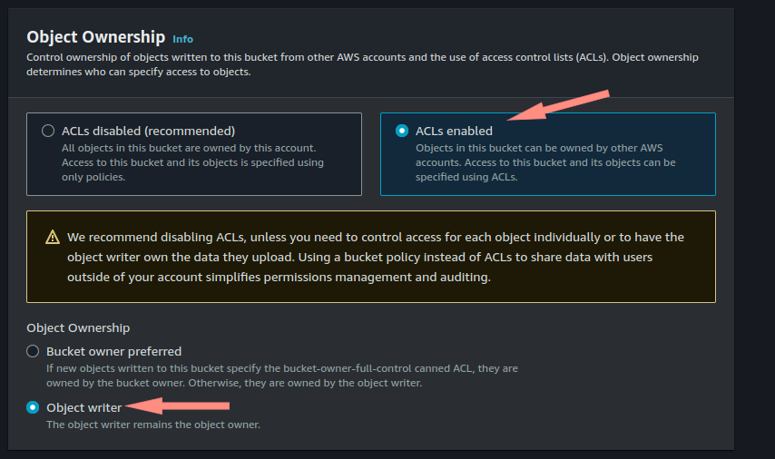

<body>
    <h2>Instruções para criar um bucket no Amazon S3:</h2>
    <ol>
        <li>Faça login no Console de Gerenciamento da AWS em <a href="https://aws.amazon.com/">https://aws.amazon.com/</a>.</li>
        <li>Vá para o serviço Amazon S3.</li>
        <li>Clique em "Criar bucket".</li>
        <li>Escolha um nome único para o seu bucket (por exemplo, "meu-portfolio").</li>
        <li>Selecione a região AWS desejada.</li>
        <li>Clique em "Criar bucket".</li>
    </ol>

    

<ol start="7">
    <li>Selecionamos AWS region como us-east-1 N.Virginia.</li>
    <li>Colocamos o nome único para Bucket.</li>
  

    

    <li>Acl</li>
    <li>Obeject writer</li>
    
</ol>
</body>