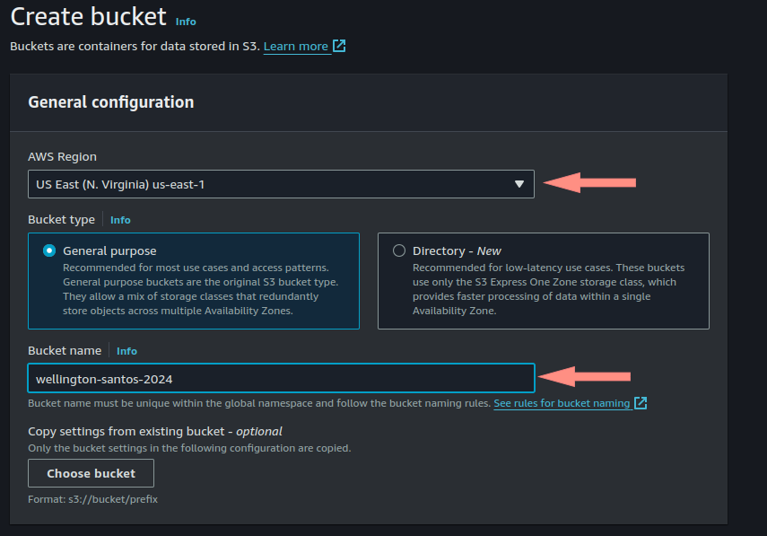

## Aws-bucket-hosting-estatico

   ## Passo 1: Criar um Bucket no Amazon S3
  
        1° Faça login no Console de Gerenciamento da AWS em https://aws.amazon.com/.
        2° Vá para o serviço Amazon S3.
        3° Clique em "Criar bucket".
        4° Escolha um nome único para o seu bucket (por exemplo, "meu-portfolio").
        5° Selecione a região AWS desejada.
        6° Clique em "Criar bucket".

        

        1° Selecionamos AWS region como us-east-1 N.Virginia.
        2° Colocamos o nome unico para Bucket

